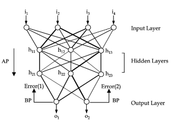

# Introduction

This project contains a crude implementation of an artificial neural network (ANN). ANNs are one of the well-known supervised learning method inspired by the human nervous system. A neural network can simply be represented as a topology of neurons (or perceptrons) stacked in layers as shown in this figure:  



The purpose is to train the network using a dataset. Each set of input values are fed to the input layer of network and each connection transfers these input values to the connected neurons. During this transfer, these values are altered based on the weight values of these connections. Finally, some values reach to the neurons in the output layer. These are the calculated output values. Then, by comparing the calculated output values with the expected values, an error is back propagated. By this back propagation, the weights in the connections are corrected a bit. Repeating this procedure using a large dataset (also repeating the same dataset many times), more correct weight values are obtained. At some point, the network yields correct enough results and we say the network is trained. By this way, ANNs can estimate the nonlinear relations between the input and output variables. They have been extensively used in various real-world applications, such as bioinformatics, text mining, face recognition.  

In this project, among the various ANN types, a shallow, multilayered feed forward neural network is implemented using back-propagation algorithm to estimate results of two different datasets.  

## Implementation Details

This neural network classifier is implemented in C++. Software architecture is formed by the classes presented below:  
1. Network.{h|cpp}: This class deals with feed forward and back propagation operations. It consists of layers.  
2. Layer.{h|cpp}: Perceptrons are stored in the objects of this class.  
3. Perceptron.{h|cpp}: Smallest unit of the network which works with weight and output set operations. It performs entire weight update procedure.  
4. IOManager.{h|cpp}: A helper class that reads the data from text files and assigns them into related variables.  
5. Engine.cpp: Entry point of the program. The first line in `main` function is used to indicate the input file. Then it builds up networks using the options given in the input file, trains them, calculates their accuracies using 4-fold cross-validation procedure, and decides which option set is best for given dataset.  

Stochastic approximation is used in this implementation, in which the algorithm iterates over the training example and altering the weights at each iteration according to the gradient.  

3 activation functions are defined in Perceptron class:
Sigmoidal Function:  
```
y(x) = 1.0 / (1.0 + exp(-x))
dy(x)/dx = y(x) * (1.0 - y(x))
```
Linear Function:  
```
y(x) = 0.1 * x
dy(x)/dx = 0.1
```
Hyperbolic Tangential Function:
```
y(x) = tanh(x)
dy(x)/dx = 1 - y(x) * y(x)
```

## Samples

ANN is tested with two different datasets from the UCI data repository using different parameters. `.input` files represent the parameters to be optimized for this dataset. `.data` files include the actual dataset values. `.output` files are contain a detailed report for each parameter set trained and tested.    

### Iris Data Set

This dataset (`Samples/iris.data`) consists 3 classes of 50 instances each referring to a type of iris plant. The first 4 values in each row of the dataset file indicates:  

1. Sepal length in cm 
2. Sepal width in cm 
3. Petal length in cm 
4. Petal width in cm 

The last value in each row indicates the class of the plant: (0) for Iris Setosa, (0.5) for Iris Versicolour, and (1) for Iris Virginica.

The parameter set given in the input file means that:  

1. Hidden layer perceptron counts: 4, 8  
2. Transfer functions: sigmoidal function, linear function, tangential function  
3. Learning rates: 0.1, 0.5, 0.9
4. Number of epochs: 1000

### MONK’s Problems Data Set

The MONK’s (`Samples/monks.data`) are based on the international comparison of learning algorithms. There are three MONK’s problem in this domain with 430 instances. The first 6 values in each row indicates:  

1. a1: 1, 2, 3  
2. a2: 1, 2, 3  
3. a3: 1, 2  
4. a4: 1, 2, 3  
5. a5: 1, 2, 3, 4  
6. a6: 1, 2  

The last value of each row represents the expected class (0 or 1) of the inputs in the same line.

The parameter set given in the input file stands for:  

1. Hidden layer perceptron counts: 5, 10  
2. Transfer functions: sigmoidal function, linear function, tangential function  
3. Learning rates: 0.1, 0.4, 0.7  
4. Number of epochs: 1000  

### Results

These are the best parameter sets for both datasets.  

Best parameters for Dataset 1 yielded an accuracy of 0.9667 with these values:

- Hidden layer perceptron counts: 8
- Activation function: sigmoidal function
- Learning rate: 0.5

Best Parameters for Dataset 2 yielded a perfect accuracy (1.0) with these values:  

- Hidden layer perceptron counts: 10  
- Activation function: sigmoidal function  
- Learning rate: 0.7  

Detailed output of each parameter set can be found in `.output` files in `Samples` folder.  
